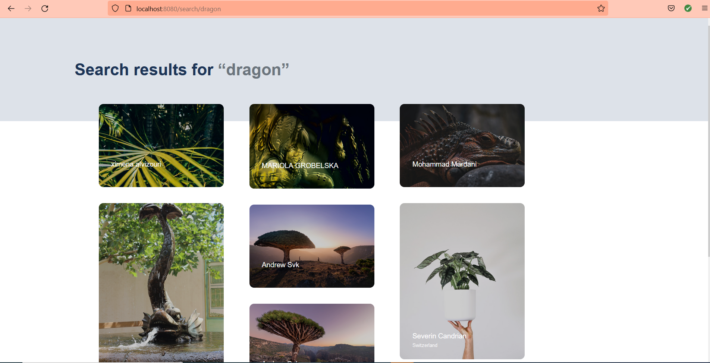
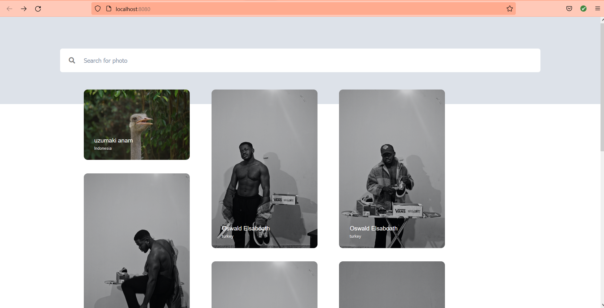
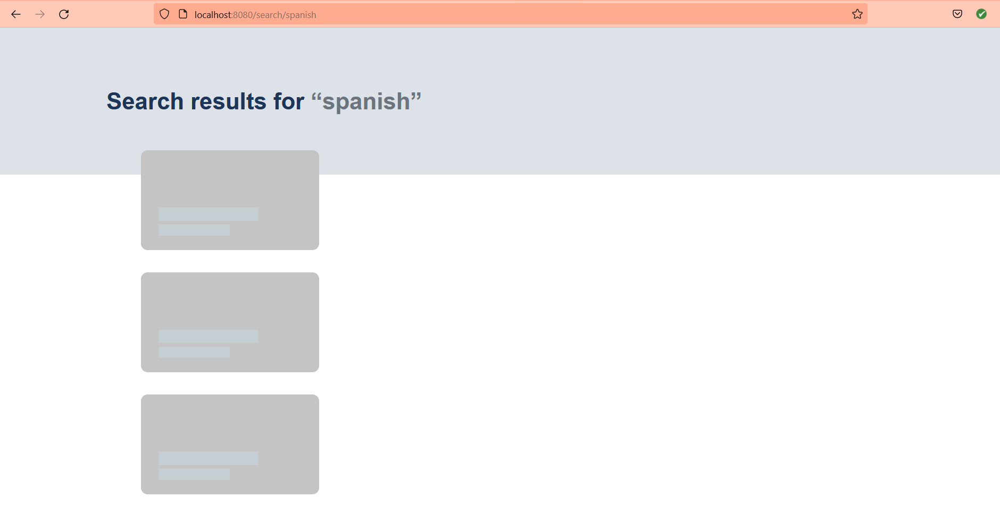
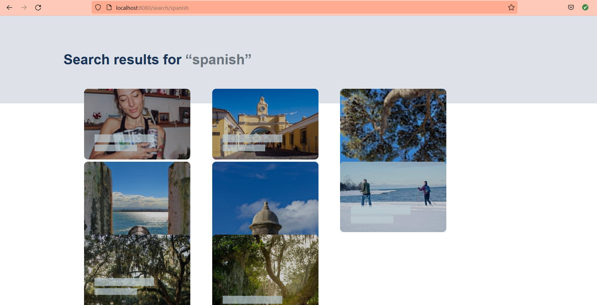
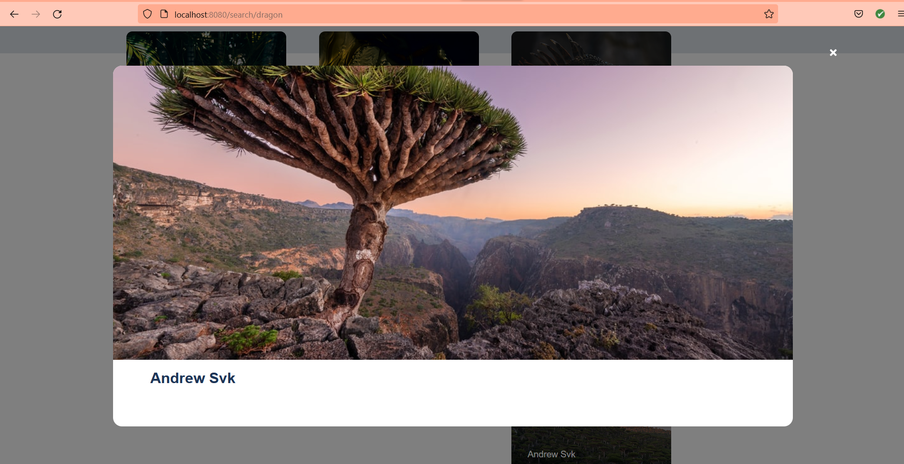

# Cowrywise Backend Job application test

It uses the **Unsplash API** , to create a mini unsplash clone using the mockups and design provided by cowrywise [here](https://www.notion.so/cowrywise/Frontend-Engineer-Test-3a4aeb677c604ca9b41cdac102d2f974)


> It does all the requirements as stated in the instructions which include:

- [x] - Usage of a staggered grid to present photos from the API along with the details of the author.
- [x] - The image card has a tint overlay on top of the images to give the text good contrast, should an image have a light background.
- [x] - It makes use of loading placeholders to provide feedback to users while fetching data from the API
- [x] - When an image is clicked, it shows a modal of the image in the best resolution that doesn't take too long to download
- [x] - Landing screen showing 8 latest photos African on unsplash.
- [x] - Search results page showing 8 latest photos based on 
a user's query.

**Note**: **A deployed version of the aplication sits [here on Netlify](https://cowrywise-frontend-test.netlify.app/)**

## Sample Images
<details>
<summary>Here are the samples.</summary>







</details>

## Built With

- [Nodejs](https://nodejs.org/en/)
- [Vue 3](https://v3.vuejs.org/)

## Project setup
```
npm install
```

> Set up `.env` file, The unsplash api key name is stored in `.env.example`. 


### Compiles and hot-reloads for development
```
npm run serve
```

### Compiles and minifies for production
```
npm run build
```

### Customize configuration
See [Configuration Reference](https://cli.vuejs.org/config/).


## Authors

**[Tawheed Oguntade](https://github.com/TWEEDOriginal/)**